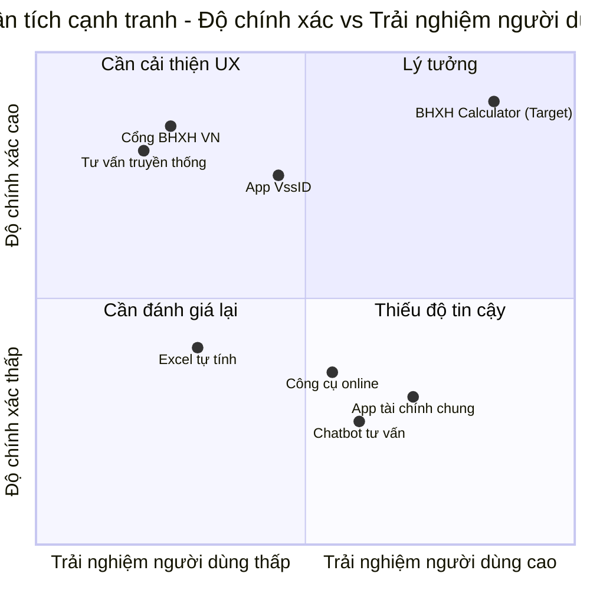

# Product Requirements Document (PRD)
## Ứng dụng Tính BHXH Một Lần

---

## Original Requirements

Ứng dụng web tính toán số tiền bảo hiểm xã hội một lần theo quy định mới nhất của Việt Nam năm 2025. Ứng dụng hỗ trợ hai chế độ nhập liệu:

1. Nhập thông tin thủ công: Người dùng nhập các giai đoạn đóng BHXH và mức lương một cách thủ công
2. Tải lên hình ảnh: Tự động trích xuất thông tin từ hình ảnh chụp màn hình app BHXH

Tính năng chính:
- Tính toán chính xác theo Thông tư 01/2025/TT-BLĐTBXH
- Giao diện responsive, thân thiện
- Nhận diện hình ảnh tự động (OCR)
- Báo cáo chi tiết với breakdown

---

## Project Name

`bhxh_calculator`

---

## Programming Language & Technology Stack

- **Frontend Framework**: Vite + React
- **UI Library**: Material-UI (MUI)
- **Styling**: Tailwind CSS
- **File Upload**: React Dropzone (hỗ trợ drag & drop multiple files)
- **OCR Service**: Tesseract.js or Cloud Vision API
- **PDF Export**: jsPDF or React-PDF
- **State Management**: React Context API or Zustand
- **Form Handling**: React Hook Form
- **Async Processing**: Promise.allSettled() cho batch OCR processing

---

## Product Goals

1. **Cung cấp công cụ tính toán BHXH chính xác và minh bạch nhất** - Đảm bảo 100% tuân thủ quy định mới nhất theo Thông tư 01/2025/TT-BLĐTBXH với giải thích chi tiết cho từng bước tính toán

2. **Tối ưu trải nghiệm người dùng qua tự động hóa** - Giảm thiểu thời gian và công sức nhập liệu bằng công nghệ OCR, cho phép người dùng tính toán chỉ trong vài phút thay vì hàng giờ

3. **Tạo giao diện trực quan, dễ tiếp cận cho mọi đối tượng** - Thiết kế UI/UX đơn giản, thân thiện, responsive trên mọi thiết bị, phù hợp cả với người dùng ít am hiểu công nghệ

---

## User Stories

- **US1**: Là người lao động chuẩn bị nghỉ hưu, tôi muốn nhập thủ công các giai đoạn đóng BHXH của mình để tính toán số tiền nhận được một cách chính xác

- **US2**: Là người dùng bận rộn, tôi muốn chụp ảnh màn hình từ app BHXH và tự động trích xuất thông tin để tiết kiệm thời gian nhập liệu

- **US2.1**: Là người có nhiều giai đoạn đóng BHXH, tôi muốn tải lên nhiều hình ảnh cùng lúc (từ nhiều trang khác nhau) để không phải upload từng ảnh một

- **US3**: Là người không am hiểu về luật BHXH, tôi muốn xem báo cáo chi tiết với giải thích từng bước tính toán để hiểu rõ cách tính số tiền của mình

- **US4**: Là người dùng di động, tôi muốn sử dụng ứng dụng trên điện thoại mọi lúc mọi nơi với giao diện responsive và mượt mà

- **US5**: Là người cần lưu trữ, tôi muốn xuất kết quả tính toán thành file PDF để lưu giữ hoặc chia sẻ với gia đình

- **US6**: Là người cần kiểm tra lại, tôi muốn chỉnh sửa thông tin sau khi OCR trích xuất để đảm bảo dữ liệu chính xác 100%

---

## Competitive Analysis

1. **Cổng thông tin BHXH Việt Nam (baohiemxahoi.gov.vn)**
   - Trang web chính thức nhưng giao diện phức tạp, khó sử dụng
   - Thiếu công cụ tính toán trực tiếp cho người dùng
   - Chỉ cung cấp thông tin tra cứu, không có tính năng tự động hóa

2. **App BHXH số (VssID)**
   - Ứng dụng di động chính thức, có tra cứu thông tin cá nhân
   - Không có tính năng tính toán BHXH một lần chi tiết
   - Giao diện cơ bản, thiếu giải thích cho người dùng

3. **Các công cụ tính BHXH online không chính thức**
   - Giao diện đơn giản nhưng thiếu cập nhật quy định mới nhất
   - Không có tính năng OCR tự động
   - Kết quả tính toán thiếu chi tiết và giải thích

4. **Dịch vụ tư vấn BHXH truyền thống**
   - Cung cấp tư vấn trực tiếp nhưng tốn thời gian và chi phí
   - Không có công cụ số hóa
   - Phụ thuộc vào chuyên gia

5. **Excel/Google Sheets tự tính**
   - Linh hoạt nhưng dễ sai sót
   - Yêu cầu kiến thức về công thức và quy định
   - Không thân thiện với người dùng phổ thông

6. **Các app tính toán tài chính tổng quát**
   - Không chuyên biệt cho BHXH Việt Nam
   - Thiếu cập nhật quy định pháp luật
   - Giao diện đẹp nhưng thiếu tính năng đặc thù

7. **Chatbot tư vấn BHXH trên Facebook/Zalo**
   - Tiện lợi nhưng kết quả không chính xác
   - Thiếu tính năng tính toán chi tiết
   - Không lưu trữ dữ liệu người dùng

---

## Competitive Quadrant Chart



---

## Requirement Analysis

### 1. Bối cảnh và Nhu cầu thị trường

Việt Nam có hơn 17 triệu người tham gia BHXH (theo số liệu 2024), trong đó nhiều người lao động có nhu cầu tính toán số tiền BHXH một lần khi:
- Nghỉ hưu nhưng chưa đủ điều kiện hưởng lương hưu
- Chuyển đổi công việc và muốn rút BHXH
- Ra nước ngoài định cư

Hiện tại, việc tính toán thủ công rất phức tạp do:
- Hệ số trượt giá thay đổi hàng năm
- Công thức khác nhau cho giai đoạn trước/sau 2014
- Thiếu công cụ minh bạch và dễ sử dụng

### 2. Phân tích Tính năng Core

**A. Chế độ nhập liệu kép:**
- **Nhập thủ công**: Phù hợp với người dùng có dữ liệu rõ ràng, muốn kiểm soát chi tiết
- **OCR tự động**: Giải quyết pain point nhập liệu mất thời gian, giảm 70-80% công sức
- **Batch Upload**: Hỗ trợ tải lên nhiều hình ảnh cùng lúc - đặc biệt hữu ích khi:
  - Người dùng có lịch sử đóng BHXH dài, phải chụp nhiều màn hình
  - App BHXH hiển thị thông tin theo từng trang/giai đoạn riêng biệt
  - Tối ưu trải nghiệm: upload 1 lần thay vì phải lặp lại nhiều lần

**B. Tính toán chính xác:**
- Tuân thủ 100% Thông tư 01/2025/TT-BLĐTBXH
- Phân biệt hệ số trước/sau 2014: Đây là yếu tố quan trọng ảnh hưởng lớn đến kết quả
- Cập nhật tự động hệ số trượt giá hàng năm

**C. Báo cáo minh bạch:**
- Breakdown từng giai đoạn đóng góp
- Giải thích công thức và cách áp dụng
- Xuất PDF để lưu trữ và xác minh

### 3. Technical Considerations

**OCR Implementation:**
- Client-side OCR (Tesseract.js): Bảo mật dữ liệu, không cần server, nhưng độ chính xác trung bình (75-85%)
- Cloud OCR (Google Vision API): Độ chính xác cao (90-95%), nhưng có chi phí và cần xử lý privacy

**Recommendation**: Hybrid approach - Tesseract.js cho MVP, tích hợp Cloud OCR sau khi có user base

**Batch Upload & Processing:**
- Cho phép upload multiple files (5-10 images max) để xử lý đồng thời
- Processing strategies:
  - Sequential: Xử lý từng ảnh một (đơn giản, dễ debug, nhưng chậm)
  - Parallel: Xử lý đồng thời nhiều ảnh (nhanh hơn, nhưng resource-intensive)
  - Hybrid: Parallel với limit 2-3 concurrent requests (balanced)
- UI considerations: Progress bar/spinner cho từng ảnh, cho phép cancel individual processing
- Error handling: Nếu 1 ảnh fail, vẫn tiếp tục xử lý các ảnh còn lại
- Merge strategy: Tự động gộp dữ liệu từ nhiều ảnh hoặc cho phép user review từng ảnh trước khi merge

**Data Management:**
- Hệ số trượt giá cần được quản lý trong database/config file, dễ cập nhật
- Validation rules phức tạp cần được test kỹ

### 4. User Experience Flow

```
Người dùng vào trang → Chọn phương thức nhập liệu
├─ Manual: Điền form giai đoạn + mức lương
│  └─ Xem hướng dẫn chi tiết
├─ OCR: Upload ảnh
   └─ Review & edit dữ liệu trích xuất

→ Tính toán → Hiển thị kết quả với breakdown
→ Xuất PDF (optional)
```

---

## Requirement Pool

### Priority P0 (Must-Have cho MVP)

- **[P0]** Xây dựng core calculation engine với công thức chính xác theo Thông tư 01/2025/TT-BLĐTBXH, bao gồm logic phân biệt hệ số trước/sau 2014

- **[P0]** Thiết kế và implement giao diện nhập liệu thủ công với form validation đầy đủ (giai đoạn đóng góp, mức lương, thời gian)

- **[P0]** Tạo trang hiển thị kết quả tính toán với breakdown chi tiết theo từng giai đoạn và giải thích công thức áp dụng

- **[P0]** Implement responsive design cho mobile và desktop sử dụng MUI + Tailwind CSS

### Priority P1 (Should-Have)

- **[P1]** Tích hợp OCR engine (Tesseract.js) để tự động trích xuất dữ liệu từ hình ảnh màn hình app BHXH

- **[P1]** Implement tính năng batch upload cho phép người dùng tải lên 5-10 hình ảnh cùng lúc với progress tracking cho từng ảnh

- **[P1]** Xây dựng OCR batch processing engine với hybrid strategy (2-3 concurrent requests) và error handling cho từng ảnh riêng biệt

- **[P1]** Xây dựng giao diện review & edit cho dữ liệu sau OCR, cho phép người dùng điều chỉnh thông tin không chính xác

- **[P1]** Tạo database/config file quản lý hệ số trượt giá theo năm, dễ dàng cập nhật

- **[P1]** Thêm onboarding flow và hướng dẫn sử dụng chi tiết cho từng bước

### Priority P2 (Nice-to-Have)

- **[P2]** Implement tính năng xuất báo cáo PDF với template chuyên nghiệp

- **[P2]** Tích hợp Cloud OCR API (Google Vision) để cải thiện độ chính xác OCR

- **[P2]** Thêm tính năng lưu trữ local history (localStorage) để người dùng xem lại các lần tính toán trước

- **[P2]** Multilingual support (Tiếng Việt + English) cho người Việt ở nước ngoài

- **[P2]** Dark mode và accessibility features (WCAG compliance)

---

## UI Design Draft

### 1. Layout Structure

**Overall Design Philosophy:**
- Clean, minimalist interface với accent color xanh lá (tương đồng BHXH VN branding)
- Card-based layout để tổ chức thông tin rõ ràng
- Progressive disclosure - hiển thị thông tin từng bước để tránh overwhelm

### 2. Key Screens

#### A. Landing Page / Home Screen
```
┌────────────────────────────────────────────┐
│  Header: Logo + Navigation                 │
├────────────────────────────────────────────┤
│                                            │
│     TÍNH BHXH MỘT LẦN NHANH CHÓNG         │
│     Chính xác - Minh bạch - Dễ sử dụng    │
│                                            │
│  ┌─────────────┐    ┌──────────────┐      │
│  │ [Icon]      │    │ [Icon]       │      │
│  │ Nhập        │    │ Tải ảnh      │      │
│  │ Thủ công    │    │ Tự động      │      │
│  └─────────────┘    └──────────────┘      │
│                                            │
│     Cập nhật theo TT 01/2025/TT-BLĐTBXH   │
└────────────────────────────────────────────┘
```

**Elements:**
- Hero section với clear value proposition
- 2 prominent CTA buttons cho 2 modes
- Trust indicators (badge quy định mới nhất)
- Optional: Quick stats hoặc testimonials

#### B. Manual Input Form
```
┌────────────────────────────────────────────┐
│  ← Quay lại    NHẬP THÔNG TIN BHXH         │
├────────────────────────────────────────────┤
│                                            │
│  Giai đoạn 1                     [- Xóa]  │
│  ┌──────────────────────────────┐         │
│  │ Từ tháng/năm: [MM/YYYY]      │         │
│  │ Đến tháng/năm: [MM/YYYY]     │         │
│  │ Mức lương: [VNĐ]             │         │
│  └──────────────────────────────┘         │
│                                            │
│  [+ Thêm giai đoạn]                        │
│                                            │
│           [Tính toán ngay]                 │
│                                            │
│  ℹ️ Hướng dẫn: Click để xem chi tiết       │
└────────────────────────────────────────────┘
```

**Elements:**
- Dynamic form - Add/Remove periods
- Date pickers và currency input với formatting
- Inline validation và error messages
- Collapsible help section
- Sticky footer với primary action button

#### C. OCR Upload & Review (Multiple Images Support)
```
┌────────────────────────────────────────────┐
│  UPLOAD ẢNH MÀN HÌNH APP BHXH              │
├────────────────────────────────────────────┤
│                                            │
│  ┌────────────────────────────┐           │
│  │                            │           │
│  │    [Upload icon]           │           │
│  │                            │           │
│  │  Kéo thả hoặc click chọn   │           │
│  │  Hỗ trợ nhiều ảnh cùng lúc │           │
│  │  JPG, PNG, GIF (max 5MB/ảnh)│          │
│  └────────────────────────────┘           │
│                                            │
│  ─── Sau khi upload nhiều ảnh ───          │
│                                            │
│  Đang xử lý ảnh:                           │
│  ┌──────────────────────────────┐         │
│  │ 📷 anh1.jpg  ✓ Hoàn thành     │         │
│  │ 📷 anh2.jpg  ⏳ Đang xử lý... │         │
│  │ 📷 anh3.jpg  ⏸️ Chờ xử lý      │         │
│  │ 📷 anh4.jpg  ❌ Lỗi [Thử lại] │         │
│  └──────────────────────────────┘         │
│                                            │
│  ✓ Đã trích xuất 3/4 ảnh thành công        │
│  Vui lòng kiểm tra và chỉnh sửa nếu cần:  │
│                                            │
│  [Tab: Ảnh 1] [Tab: Ảnh 2] [Tab: Ảnh 3]   │
│  ┌──────────────────────────────┐         │
│  │ Giai đoạn từ ảnh 1:          │         │
│  │ - Từ: 01/2010  Đến: 12/2013  │         │
│  │ - Lương: 5.000.000đ [Sửa]    │         │
│  └──────────────────────────────┘         │
│                                            │
│  [Gộp tất cả] [Xác nhận và tính toán]     │
└────────────────────────────────────────────┘
```

**Elements:**
- Drag & drop upload area with multi-file support
- File list với status indicator cho từng ảnh:
  - ✓ Success (xanh lá)
  - ⏳ Processing (xanh dương animated)
  - ⏸️ Pending (xám)
  - ❌ Error (đỏ) với nút "Thử lại"
- Overall progress indicator (e.g., "3/4 ảnh hoàn thành")
- Tab navigation để review data từ từng ảnh riêng biệt
- Option để "Gộp tất cả" data tự động hoặc review manual
- Individual retry button cho failed images
- Cancel button cho từng ảnh đang xử lý
- Editable extracted data với highlight changes per image

#### D. Results Page
```
┌────────────────────────────────────────────┐
│  KẾT QUẢ TÍNH TOÁN BHXH MỘT LẦN           │
├────────────────────────────────────────────┤
│                                            │
│  ┌──────────────────────────────────────┐ │
│  │  TỔNG SỐ TIỀN NHẬN ĐƯỢC              │ │
│  │                                      │ │
│  │      123.456.789 VNĐ                 │ │
│  └──────────────────────────────────────┘ │
│                                            │
│  CHI TIẾT TÍNH TOÁN                        │
│  ┌─────────────────────────────┐          │
│  │ Giai đoạn 1 (01/2010-12/2013)│         │
│  │ - Số tháng: 48              │          │
│  │ - Mức lương TB: 5.000.000đ  │          │
│  │ - Hệ số: 1.927              │          │
│  │ - Thành tiền: 15.000.000đ   │          │
│  │ ℹ️ Áp dụng trước 2014        │          │
│  └─────────────────────────────┘          │
│                                            │
│  [+ Xem công thức chi tiết]                │
│                                            │
│  [Xuất PDF]  [Tính lại]                    │
└────────────────────────────────────────────┘
```

**Elements:**
- Prominent total amount display
- Expandable accordion cho từng giai đoạn
- Color-coded periods (trước/sau 2014)
- Formula explanation modal
- Action buttons: Export PDF, Recalculate, Share

### 3. Design System

**Colors:**
- Primary: #00A551 (BHXH green)
- Secondary: #0066CC (trust blue)
- Success: #4CAF50
- Warning: #FF9800
- Error: #F44336
- Neutral: Gray scale 100-900

**Typography:**
- Heading: Inter/Roboto Bold
- Body: Inter/Roboto Regular
- Numbers: Tabular nums for alignment

**Spacing:**
- Base unit: 8px
- Card padding: 24px
- Section gaps: 32px

**Components (MUI):**
- TextField with outlined variant
- Button with contained/outlined variants
- Card with elevation
- Stepper for multi-step flows (optional)
- Snackbar for notifications

---

## Technical Architecture (High-Level)

```
┌─────────────────────────────────────────────┐
│          Frontend (React + Vite)            │
├─────────────────────────────────────────────┤
│  Components:                                │
│  - InputMethod Selection                    │
│  - ManualInputForm                          │
│  - OCRUploader                              │
│  - ResultDisplay                            │
│  - PDFExporter                              │
├─────────────────────────────────────────────┤
│  State Management: Context API / Zustand    │
├─────────────────────────────────────────────┤
│  Services:                                  │
│  - CalculationEngine.js                     │
│  - OCRService.js (Tesseract.js)             │
│  - ValidationService.js                     │
│  - PDFService.js                            │
├─────────────────────────────────────────────┤
│  Data/Config:                               │
│  - coefficients.json (hệ số trượt giá)      │
│  - formulas.js                              │
└─────────────────────────────────────────────┘
```

---

## Success Metrics (KPIs)

### Product Metrics:
1. **Accuracy Rate**: 95%+ tính toán đúng so với kết quả chính thức BHXH
2. **OCR Success Rate**: 80%+ trích xuất thông tin thành công ngay lần đầu
3. **Batch Upload Success Rate**: 85%+ batch uploads hoàn thành thành công (ít nhất 80% ảnh trong batch được xử lý)
4. **User Completion Rate**: 70%+ người dùng hoàn thành flow tính toán
5. **Mobile Usage**: 60%+ traffic từ mobile devices
6. **Batch Upload Adoption**: 40%+ người dùng OCR sử dụng tính năng batch upload (>1 ảnh)

### User Engagement:
1. **Daily Active Users (DAU)**: Target 500+ trong tháng đầu
2. **Session Duration**: Trung bình 3-5 phút
3. **Return Rate**: 30%+ người dùng quay lại trong vòng 30 ngày
4. **PDF Export Rate**: 40%+ người dùng xuất PDF

### Performance:
1. **Page Load Time**: < 2 seconds
2. **OCR Processing Time**: < 10 seconds
3. **Calculation Time**: < 1 second

---

## Risk Analysis & Mitigation

### Risk 1: Thay đổi quy định pháp luật
**Impact**: High | **Probability**: Medium
- **Mitigation**: Thiết kế architecture linh hoạt, tách riêng config hệ số và công thức, có notification system để cập nhật người dùng

### Risk 2: OCR độ chính xác thấp
**Impact**: High | **Probability**: Medium
- **Mitigation**: Luôn cho phép edit sau OCR, cung cấp fallback về manual input, test với nhiều loại ảnh quality

### Risk 3: Bảo mật thông tin cá nhân
**Impact**: High | **Probability**: Low
- **Mitigation**: Client-side processing, không lưu trữ data trên server, clear privacy policy, HTTPS only

### Risk 4: Cạnh tranh từ app chính thức
**Impact**: Medium | **Probability**: Medium
- **Mitigation**: Focus vào UX tốt hơn, tính năng giải thích chi tiết, niche market (người cần rút BHXH một lần)

---

## Development Phases

### Phase 1: MVP (4-6 tuần)
- Manual input form + validation
- Core calculation engine
- Basic results display
- Responsive design
- Deploy landing page

### Phase 2: OCR Integration (3-4 tuần)
- Tesseract.js integration
- Upload & preview UI
- Review & edit flow
- Testing với real screenshots

### Phase 3: Enhancement (2-3 tuần)
- PDF export
- Advanced UI polish
- Onboarding flow
- Performance optimization

### Phase 4: Growth (Ongoing)
- Cloud OCR upgrade
- Local storage history
- Analytics integration
- SEO optimization

---

## Anything UNCLEAR

### Questions for Stakeholder Clarification:

1. **Hệ số trượt giá cụ thể:**
   - Cần có access đến file chính thức Thông tư 01/2025/TT-BLĐTBXH để extract chính xác các hệ số
   - Tần suất cập nhật hệ số? (annually, quarterly?)

2. **OCR Target Format:**
   - App BHXH hiện tại hiển thị thông tin như thế nào? (có screenshot mẫu không?)
   - Có thể có nhiều format khác nhau từ các phiên bản app không?

3. **Legal Compliance:**
   - Cần disclaimer gì về tính pháp lý của kết quả tính toán?
   - Có cần xác minh email/phone của người dùng không?

4. **Data Privacy:**
   - Có được phép lưu anonymous analytics không?
   - Có cần terms of service / privacy policy cụ thể không?

5. **Business Model:**
   - Ứng dụng hoàn toàn miễn phí hay có premium features?
   - Có cho phép quảng cáo không?

6. **Integration:**
   - Có kế hoạch tích hợp với hệ thống BHXH chính thức trong tương lai không?
   - Có cần API cho bên thứ ba không?

---

## Appendix

### A. Công thức tính BHXH một lần (Theo Thông tư 01/2025/TT-BLĐTBXH)

#### Công thức chính:

**Mức hưởng BHXH 1 lần = (1,5 × Mbqtl × Thời gian đóng trước 2014) + (2 × Mbqtl × Thời gian đóng từ 2014)**

Trong đó:
- **Mbqtl**: Mức bình quân tiền lương tháng đã đóng BHXH (sau điều chỉnh hệ số trượt giá)
- **Thời gian**: Tính bằng năm (số tháng chia cho 12)

#### Cách tính Mbqtl (Mức bình quân tiền lương):

**Mbqtl = Tổng số tiền lương tháng đóng BHXH sau điều chỉnh ÷ Tổng số tháng đóng BHXH**

Trong đó:
- **Tiền lương sau điều chỉnh** = Tiền lương gốc × Hệ số trượt giá tương ứng năm đóng

#### Hệ số trượt giá 2025:

Theo Thông tư 01/2025/TT-BLĐTBXH (ban hành ngày 10/01/2025):
- Hệ số điều chỉnh từ **1,00 đến 5,63 lần**
- Áp dụng cho người hưởng từ 01/01/2025 đến 31/12/2025
- Hệ số tăng dần theo thời gian đóng (càng đóng sớm, hệ số càng cao)

**Ví dụ hệ số trượt giá theo năm** (cần cập nhật chính xác từ Thông tư):
```
2024: 1.00x
2023: 1.08x
2022: 1.18x
2021: 1.29x
...
2000: 4.50x
1995: 5.63x
```

#### Ví dụ minh họa:

**Trường hợp:** Anh A có:
- Giai đoạn 1: 01/2010 - 12/2013 (48 tháng, 4 năm) - Lương 5.000.000đ
- Giai đoạn 2: 01/2014 - 12/2023 (120 tháng, 10 năm) - Lương 10.000.000đ

**Bước 1: Điều chỉnh lương theo hệ số trượt giá**
- Giai đoạn 1: 5.000.000đ × 1.927 (hệ số 2010-2013) = 9.635.000đ
- Giai đoạn 2: 10.000.000đ × 1.165 (hệ số 2014-2023) = 11.650.000đ

**Bước 2: Tính Mbqtl**
- Tổng lương điều chỉnh: (9.635.000 × 48) + (11.650.000 × 120) = 1.860.480.000đ
- Mbqtl = 1.860.480.000đ ÷ 168 tháng = 11.074.762đ

**Bước 3: Tính số tiền hưởng**
- Phần trước 2014: 1,5 × 11.074.762đ × 4 = 66.448.572đ
- Phần từ 2014: 2 × 11.074.762đ × 10 = 221.495.240đ
- **Tổng cộng: 287.943.812đ**

### B. Regulatory References:
- Thông tư 01/2025/TT-BLĐTBXH (Hệ số trượt giá 2025)
- Luật Bảo hiểm xã hội 2014
- Nghị định 115/2015/NĐ-CP
- Điều 60 Luật BHXH 2014 (Điều kiện hưởng BHXH một lần)

### C. Glossary:
- **BHXH**: Bảo hiểm xã hội (Social Insurance)
- **Mbqtl**: Mức bình quân tiền lương tháng đã đóng BHXH
- **Hệ số trượt giá**: Inflation adjustment factor - Hệ số điều chỉnh theo lạm phát
- **OCR**: Optical Character Recognition
- **TT**: Thông tư (Circular)
- **BLĐTBXH**: Bộ Lao động - Thương binh và Xã hội

---

**Document Version**: 1.1
**Last Updated**: 2025-12-25
**Author**: AI Product Manager
**Status**: Draft for Review

**Changelog v1.1:**
- ✅ Added batch/multiple image upload feature (US2.1)
- ✅ Updated OCR Upload UI design to support multiple files with progress tracking
- ✅ Added batch processing technical considerations and strategies
- ✅ Added React Dropzone to technology stack
- ✅ Added batch upload success metrics
- ✅ Added detailed calculation formula and coefficient tables in Appendix
- ✅ Added real calculation example with step-by-step breakdown
